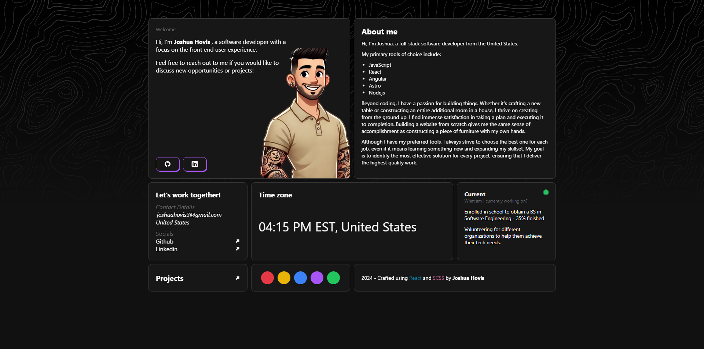

### Screenshot

**Desktop version of the final product**

# My Portfolio

A personal portfolio website showcasing my skills, projects, and experience as a software developer. This site is designed to provide a comprehensive overview of my work and capabilities, ensuring a responsive and interactive user experience.

## Features

-   Interactive selection to change color of components on the page
-   Responsive design for optimal viewing on all devices
-   Seamless navigation using React Router
-   Dynamic and reusable components with custom hooks

## Built With

-   React Router for navigation
-   Custom hooks for reusable logic
-   Context API for state management
-   CSS Grid and Flexbox for responsive design
-   SCSS for modular and maintainable styles
-   BEM Methodology for clear and structured CSS
-   Mobile-first workflow for optimal user experience on all devices
-   GitHub Pages for deployment

### Installation

Clone the repository:

`git clone https://github.com/your-username/your-portfolio-repo.git`

Navigate to the project directory:

`cd your-portfolio-repo`

Install dependencies:

`npm install`

### Usage

Start the development server:

`npm start`

Open your browser and navigate to `http://localhost:3000` to view the portfolio.

## Author

-   Website - [GitHub](https://github.com/joshhovis)
-   LinkedIn - [LinkedIn](https://www.linkedin.com/in/joshua-hovis/)
